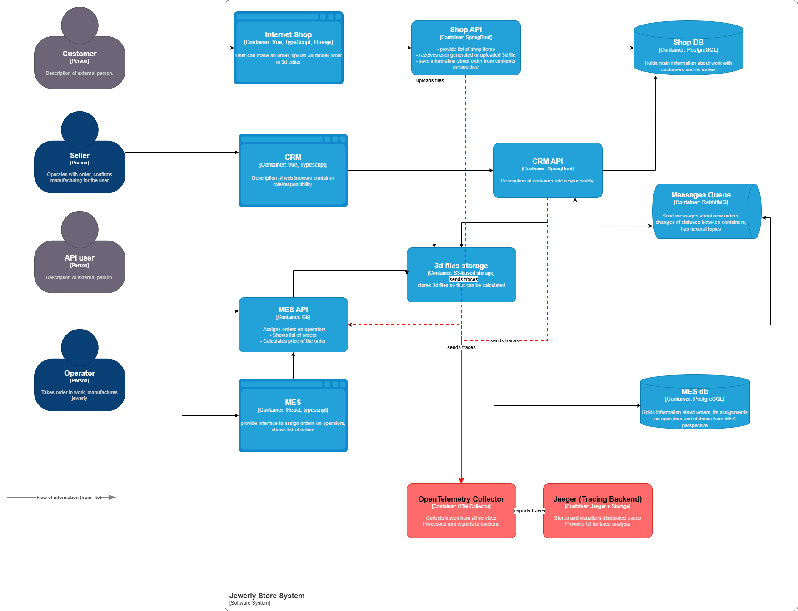
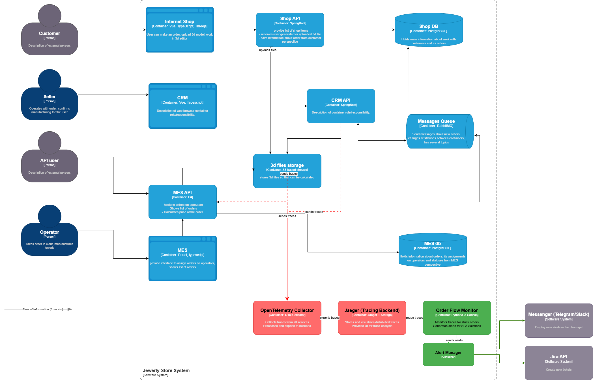

### **Этап 1: Анализ системы и C4-диаграммы**

**Критические точки, где заказ может «сломаться» или зависнуть:**

1.  **Передача заказа в MES для расчета.** После `SUBMITTED` сообщение о новом заказе отправляется через RabbitMQ от Shop/CRM API к MES API. Потеря сообщения = заказ никогда не начнет обрабатываться.
2.  **Расчет стоимости в MES API.** Операция на 2–30 минут. Может упасть, зависнуть или создать очередь, блокируя последующие этапы.
3.  **Отправка результата расчета обратно в CRM.** MES публикует `PRICE_CALCULATED` в RabbitMQ. Потеря этого сообщения — заказ «исчезнет» для продавцов в CRM.
4.  **Назначение заказа оператору.** Оператор в медленном UI MES не может взять заказ. Задержка на этом этапе приводит к прямому простою производства.
5.  **Создание заказа через B2B API.** Прямой вызов `MES API` для расчета. Высокая нагрузка может привести к таймаутам и потере запроса партнера.

**Системы, которые следует покрыть трейсингом:**
*   Shop API (Spring Boot)
*   CRM API (Spring Boot)
*   MES API (C#)
*   RabbitMQ (продюсеры и консюмеры во всех сервисах)

**Данные для трейсинга:**
*   **Обязательные:** `trace_id`, `span_id`, `order_id`, `service.name`, `start_time`, `end_time`, `status.code` (OK/ERROR).
*   **Контекст запроса:** `http.method`, `http.route`, `http.status_code`.
*   **Контекст сообщений:** `messaging.system`=`rabbitmq`, `messaging.destination` (имя очереди).
*   **Контекст бизнес-процесса:** `order_status`, `operation` (например, `price_calculation`).

---

### **Этап 2: Мотивация**

**Без трейсинга команда «Александрита» слепа.** Проблемы (потеря заказов, месячные задержки) обнаруживаются по жалобам, расследование — ручной поиск по логам трех разных систем.

**Трейсинг даст:**
1.  **Сквозную видимость жизненного цикла заказа** за секунды, а не часы.
2.  **Точное определение этапа, где произошел сбой:** потеря сообщения, падение расчета, ошибка БД.
3.  **Данные для SLA:** измерение времени прохождения каждого статуса (`SUBMITTED` → `PRICE_CALCULATED`, `APPROVED` → `SHIPPED`).

**Влияние на метрики (3 технические, 2 бизнес):**
*Технические:*
1.  **MTTR (Mean Time To Resolve):** Сократится с часов/дней до десятков минут.
2.  **Процент успешно завершенных трассировок заказа:** Позволит измерить надежность сквозного потока.
3.  **p95 времени расчета стоимости:** Выявит аномалии и обоснует необходимость выделения этого сервиса.

*Бизнес-метрики:*
1.  **Процент заказов, выполненных в срок (3 недели):** Позволит отслеживать улучшения.
2.  **Количество жалоб от B2B-партнеров на «потерянные» заказы:** Должно уменьшиться до нуля.

---

### **Этап 3: Предлагаемое решение**

**Технология: OpenTelemetry (OTel).**
*   **Причина:** Стандарт, поддержка Java (Spring Boot), .NET (C#), RabbitMQ.
*   **Архитектура:**
    1.  **Инструментация сервисов:** OTel SDK в Shop API, CRM API, MES API. Автоматически создает spans для HTTP и ручные — для ключевых операций (например, `price_calculation`).
    2.  **Передача контекста:** Через HTTP-заголовки (`traceparent`) и заголовки сообщений RabbitMQ.
    3.  **Коллектор:** OpenTelemetry Collector (отдельный контейнер). Принимает трассы от всех сервисов по OTLP/gRPC.
    4.  **Бэкенд:** Jaeger. Хранит трассы, предоставляет UI для поиска. Retention — 7 дней.
    5.  **Связь с метриками:** Collector может генерировать метрики из трасс (например, длительность расчета) и отправлять в Prometheus.

**Новые компоненты на схеме (красным):**
1.  Контейнер **«OpenTelemetry Collector»**.
2.  Контейнер **«Jaeger (Tracing Backend)»**.
3.  Стрелки от **Shop API**, **CRM API**, **MES API** к **Collector**.
4.  Стрелка от **Collector** к **Jaeger**.

[Ссылка на схему C4 с новыми компонентами (v1)](jewerly_c4_model_tracing_v1.drawio)

---

### **Этап 4: Компромиссы**

1.  **Затраты на внедрение в MES (C#).** В отличие от Java, нет "магической" автоинструментации. Потребуется **ручное добавление кода** для обертывания ключевых методов (расчет стоимости, работа с очередями). Это время C#-разработчика.
2.  **Увеличение объема данных.** Трассировка каждого запроса создаст нагрузку на сеть и хранилище. **Компромисс:** Включить **сэмплирование** (sampling). Например, 100% трасс для ошибок, но только 10% для успешных запросов.
3.  **"Слепые зоны".** Если внешняя система (например, служба доставки) не поддерживает OTel, цепочка трассировки в этом месте оборвется. Это придется компенсировать логированием.
4.  **Производительность.** Включение трейсинга добавляет небольшие накладные расходы (~1-3% на CPU/латентность). Для MES API с его тяжелыми расчетами это приемлемо.

---

### **Этап 5: Аспекты безопасности**

1.  **Контроль доступа.** UI Jaeger будет доступен **только из корпоративной сети/VPC**. Вход — через корпоративный SSO (например, Yandex 360). Роли: `readonly` (поддержка), `admin` (разработчики).
2.  **Защита данных (PII).** В трассы **не должны попадать** персональные данные (ФИО, email, телефон). Настроим **фильтр в OTel Collector**, который будет удалять такие поля из атрибутов spans.
3.  **Шифрование.** Трафик между сервисами и Collector (`OTLP`) будет идти по **TLS**.
4.  **Аудит.** Все запросы к Jaeger UI будут логироваться.

---

### **Этап 6 (Дополнительно): Автоматический мониторинг и алертинг**

**Идея:** Использовать данные трассировки для автоматического обнаружения «зависших» заказов.

**Реализация:**
1.  **Периодический джоб «Order Flow Monitor»** (отдельный микросервис или скрипт).
2.  **Логика:** Раз в 5 минут опрашивает Jaeger API, ищет трассы с тегом `order_id`, где последний span старше N часов и не имеет статуса `CLOSED` или `SHIPPED`.
3.  **Действие:** При обнаружении таких трасс:
    *   **Метрика:** Увеличивает счетчик `stuck_orders_total`.
    *   **Алерт:** Если счетчик > порога — Alertmanager отправляет уведомление в Slack-канал поддержки.
    *   **Тикет:** Автоматически создает инцидент в Jira с приложением `trace_id` для расследования.

**Новые компоненты на схеме (зеленым):**
1.  Контейнер **«Order Flow Monitor»**.
2.  Стрелки от него к **Jaeger API** и к **Alertmanager**.
3.  Стрелки в **Slack** и **Jira**.

[Ссылка на схему C4 с мониторингом (v2)](jewerly_c4_model_tracing_v2.drawio)
