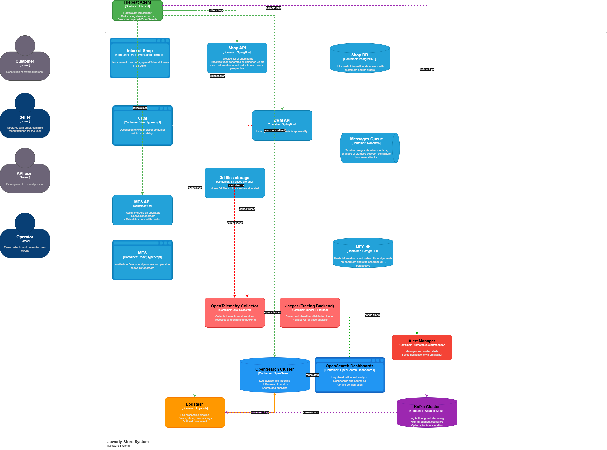

# Архитектурное решение по логированию

## 1. Анализ системы и планирование логирования

На основе C4-модели определены ключевые системы для сбора логов:

| Система         | Технология | Тип логов (INFO)                          | Комментарий                                                       |
|----------------|-----------|-------------------------------------------|------------------------------------------------------------------|
| **Shop API**    | SpringBoot | Создание/изменение заказа, загрузка 3D-файла | Основной клиентский вход, требует детального логирования бизнес-событий |
| **CRM API**     | SpringBoot | Изменение данных клиента, обновление статусов | Критична для обслуживания клиентов и поддержки                     |
| **MES API**     | C#        | Назначение заказа оператору, изменение статуса производства | Ключевая система производственного цикла                         |
| **Messages Queue** | RabbitMQ  | Доставка/потребление сообщений (topic, message ID) | Мониторинг асинхронной коммуникации между системами               |
| **Shop DB**     | PostgreSQL | Медленные запросы, ошибки соединения          | Инфраструктурные логи для диагностики производительности           |
| **MES DB**      | PostgreSQL | Медленные запросы, ошибки соединения          | Инфраструктурные логи для диагностики производительности           |
| **3D files storage** | S3     | Загрузка/скачивание файлов, ошибки доступа | Мониторинг операций с файлами                                     |

### Уровни логирования:
- **DEBUG** – отладка сложной бизнес-логики (расчёт стоимости, обработка файлов).
- **WARN** – нестандартные, но некритичные ситуации (повторная отправка сообщения).
- **ERROR** – сбои, исключения, недоступность внешних сервисов.
- **INFO** – основные бизнес-события (по умолчанию).

---

## 2. Мотивация

Логирование необходимо для:
1. **Сокращения времени диагностики** проблем с минут/часов до секунд.
2. **Повышения прозрачности** работы системы для поддержки и разработки.
3. **Автоматизации анализа** инцидентов и аномалий.

### Технические и бизнес-метрики, на которые повлияет логирование:
- **MTTR (Mean Time To Resolution)** – снижение за счёт быстрого поиска корневых причин.
- **Количество обращений в поддержку** – уменьшение благодаря самообслуживанию через логи.
- **Доступность сервиса (SLA)** – оперативное выявление деградаций.
- **Удовлетворённость клиентов** – меньше ошибок и быстрее реакция на проблемы.
- **Эффективность разработки** – меньше времени на воспроизведение багов.

### Приоритет внедрения:
1. **Shop API + CRM API** – как основные клиентские и заказные сервисы.
2. **MES API** – критичен для производственного процесса.
3. **RabbitMQ + Базы данных** – инфраструктурные компоненты.

---

## 3. Предлагаемое решение

### Технологический стек:
- **Агенты сбора:** Filebeat (легковесный, встраивается в контейнеры).
- **Транспорт и буферизация:** Начальный этап – прямая отправка в Elasticsearch. При росте нагрузки – внедрение **Kafka** как надежного буфера.
- **Альтернативный транспорт:** Для умеренных объемов можно использовать **RabbitMQ** (уже есть в инфраструктуре), но с учетом его ограничений по высокой пропускной способности.
- **Сбор инфраструктурных логов:** **Syslog** (через rsyslog/syslog-ng) для системных логов ОС и сетевых устройств.
- **Хранилище:** **OpenSearch** (Apache 2.0, open-source, совместим с ELK-экосистемой).
- **Визуализация и анализ:** **OpenSearch Dashboards**.
- **Трассировка:** OpenTelemetry Collector + Jaeger (уже заложено в схеме).

### Компоненты на схеме:
Добавляются:
- **Filebeat Agent** в каждый контейнер приложения (Shop API, CRM API, MES API).
- **OpenSearch Cluster** с hot/warm/cold узлами.
- **OpenSearch Dashboards** для визуализации.
- **Logstash** (опционально) как промежуточный процессор для сложных трансформаций.
- **Kafka/RabbitMQ** (будущее расширение) между агентами и OpenSearch.

### Политика безопасности:
- **Маскировка PII** (персональных данных) на этапе сбора/индексирования.
- **Шифрование** логов в transit (TLS) и at rest.
- **RBAC** в OpenSearch Dashboards: доступ только для DevOps, поддержки и разработки.
- **Аудит** доступа к логам.

### Политика хранения:
- Индексы по шаблону `logs-<service>-<yyyy.mm.dd>`.
- **Горячие данные:** 7 дней (быстрый доступ).
- **Тёплые данные:** 30 дней (редкие запросы).
- **Холодные данные:** 90 дней (архив, в S3-совместимом хранилище).
- **Расчётный объём:** ~10 ГБ/день для всей системы (оценка).

---

## 4. Анализ логов и алертинг

### Алертинг:
- **Prometheus + Alertmanager** для мониторинга метрик (частота ошибок, latency).
- **ElastAlert** (или аналог для OpenSearch) для правил на основе логов:
  - Резкий рост ошибок 5xx (>10% за 5 минут).
  - Аномальное количество созданных заказов (>1000/сек – возможен DDoS).
  - Отсутствие логов от критичного сервиса >2 минут.

### Поиск аномалий:
- **Машинное обучение** (встроенные средства OpenSearch) для обнаружения аномалий в паттернах запросов.
- **Дашборды** в OpenSearch Dashboards с ключевыми метриками в реальном времени.

---

## 5. Дополнительное задание: Критерии выбора технологии

| Критерий         | ELK (Elastic Stack)        | OpenSearch                 | Splunk                     |
|------------------|----------------------------|----------------------------|----------------------------|
| Лицензия         | Elastic License (SSPL)     | Apache 2.0                 | Проприетарная              |
| Стоимость        | Бесплатен, платные опции   | Полностью открытый         | Высокая                    |
| Масштабируемость | Высокая                    | Высокая                    | Высокая                    |
| Интеграция       | Широкая, богатый экосистема| Совместим с ELK-экосистемой| Готовые коннекторы         |
| Поддержка        | Коммерческая / Community   | Community / AWS            | Полная коммерческая        |

**Выбор:** **OpenSearch** – полностью open-source решение под лицензией Apache 2.0, что устраняет лицензионные риски. Полная совместимость с инструментами ELK-экосистемы, активное сообщество и поддержка со стороны AWS. Рекомендуется как устойчивый и прогнозируемый выбор для long-term использования.

---

## 6. Практические рекомендации по внедрению

1. **Этап 1 (Пилотный)**
   Внедрение начинается с ключевых сервисов и прямой отправки логов для минимизации сложности. Filebeat развертывается на Shop API и CRM API как наиболее критичных для бизнеса компонентах. Настройка базовых дашбордов в OpenSearch Dashboards позволит команде быстро получить ценность от системы.

2. **Этап 2 (Масштабирование)**
   После успешного пилота подключаются остальные сервисы: MES API, базы данных и RabbitMQ. На этом этапе при необходимости внедряется Logstash для сложных трансформаций данных (парсинг, обогащение, фильтрация). Одновременно настраивается алертинг через ElastAlert для автоматического обнаружения инцидентов.

3. **Этап 3 (Оптимизация и надежность)**
   На основе мониторинга нагрузки на OpenSearch принимается решение о внедрении буфера. Kafka рекомендуется как наиболее надежное и производительное решение для high-throughput сценариев. Также на этом этапе окончательно настраиваются политики ротации, архивации и безопасности логов.

4. **Использование существующего RabbitMQ**
   RabbitMQ может выступать транспортом для логов при умеренном объеме данных, но не рекомендуется для high-throughput из-за ограничений производительности и масштабируемости. При выборе этого пути необходима настройка persistent queues и тщательный мониторинг backlog.

5. **Использование Syslog**
   Syslog рекомендуется исключительно для сбора инфраструктурных логов (ОС, сетевые устройства, системные сервисы). Для логов приложений следует использовать специализированные агенты (Filebeat/Fluentd), которые лучше справляются со структурированными данными и обеспечивают более эффективную интеграцию с OpenSearch.

**Общий принцип:** Начинать с простой архитектуры, масштабировать и добавлять компоненты по мере роста нагрузки и требований к надежности. Каждый этап должен приносить измеримую ценность и не создавать избыточной сложности.
