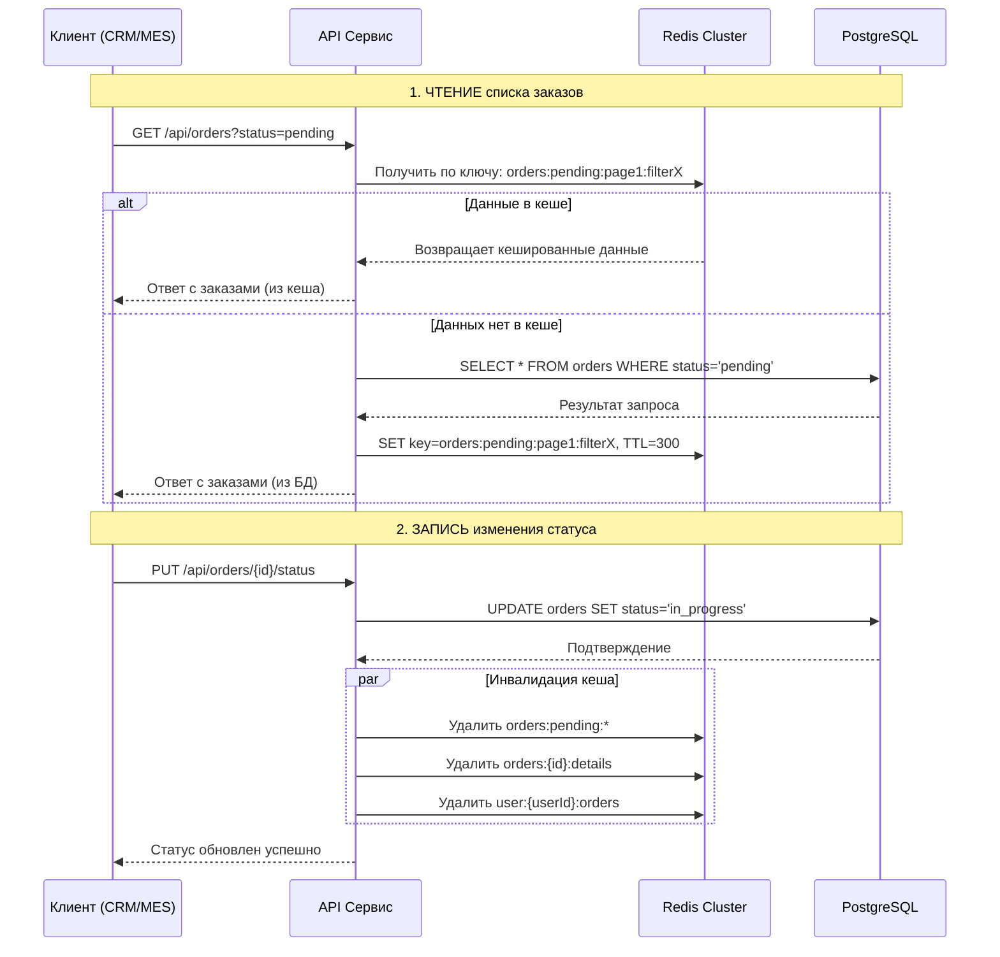

```mermaid
sequenceDiagram
    participant C as Клиент (CRM/MES)
    participant API as API Сервис
    participant Cache as Redis Cluster
    participant DB as PostgreSQL
    
    %% Операция чтения списка заказов
    Note over C,DB: 1. ЧТЕНИЕ списка заказов
    C->>API: GET /api/orders?status=pending
    API->>Cache: Получить по ключу: orders:pending:page1:filterX
    alt Данные в кеше
        Cache-->>API: Возвращает кешированные данные
        API-->>C: Ответ с заказами (из кеша)
    else Данных нет в кеше
        API->>DB: SELECT * FROM orders WHERE status='pending'
        DB-->>API: Результат запроса
        API->>Cache: SET key=orders:pending:page1:filterX, TTL=300
        API-->>C: Ответ с заказами (из БД)
    end
    
    %% Операция изменения статуса заказа
    Note over C,DB: 2. ЗАПИСЬ изменения статуса
    C->>API: PUT /api/orders/{id}/status
    API->>DB: UPDATE orders SET status='in_progress'
    DB-->>API: Подтверждение
    par Инвалидация кеша
        API->>Cache: Удалить orders:pending:*
        API->>Cache: Удалить orders:{id}:details
        API->>Cache: Удалить user:{userId}:orders
    end
    API-->>C: Статус обновлен успешно
```