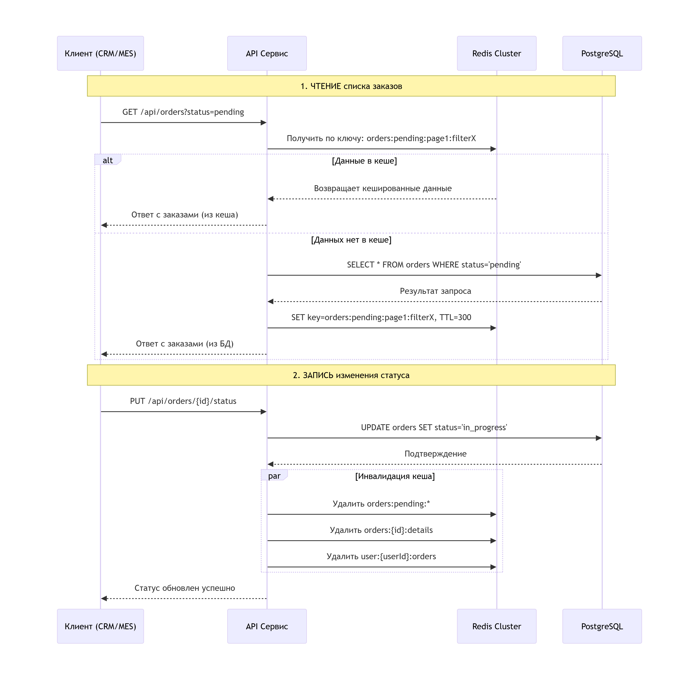

# Архитектурное решение по кешированию

## 1. Анализ системы и выбор объектов для кеширования

Проанализировав C4-диаграмму системы "Александрит", я выделил ключевые узкие места, где кеширование принесёт максимальную пользу. Система испытывает высокую нагрузку при работе со списками заказов — операторы постоянно запрашивают фильтрованные выборки в CRM и MES, а клиенты просматривают каталог изделий. При этом данные о заказах меняются сравнительно редко после их создания, что делает их идеальными кандидатами для кеширования. Я сосредоточусь на трёх основных областях: списки заказов с различными фильтрами, детальная информация о конкретных заказах и каталог товаров в интернет-магазине.

## 2. Мотивация внедрения кеширования

Текущая система сталкивается с проблемами производительности при пиковых нагрузках. Операторы жалуются на медленную загрузку списков заказов, особенно в утренние часы и в конце месяца при подготовке отчётов. Бизнес теряет эффективность из-за простоев сотрудников, ожидающих загрузки данных. Кеширование решит эти проблемы, ускорив доступ к часто запрашиваемой информации в 5-10 раз. Это не только улучшит опыт работы операторов, но и снизит нагрузку на базы данных, позволяя системе масштабироваться без дорогостоящего увеличения вычислительных ресурсов.

## 3. Предлагаемое решение

### 3.1. Тип кеширования: **Серверное кеширование**

Я выбираю серверное кеширование, так как оно лучше всего подходит для распределённой архитектуры нашей системы. Централизованный кеш обеспечит согласованность данных для всех пользователей CRM, MES и интернет-магазина. Это позволит эффективно управлять инвалидацией кеша при изменениях и избежать ситуации, когда разные пользователи видят разные данные. Серверный подход также снижает нагрузку на клиентские приложения и даёт больше контроля над стратегиями кеширования.
**Архитектура:**
```
Дополняем существующую систему:
- Redis Cluster (распределенный кеш)
- Расположен между API-сервисами и БД
- Поддержка репликации для отказоустойчивости
```
### 3.2. Паттерн кеширования: **Cache-Aside (Lazy Loading)**

Для реализации выбран паттерн Cache-Aside, который идеально соответствует нашей модели использования данных. Большинство операций в системе — это чтение информации о заказах и товарах, при этом записи происходят значительно реже. Cache-Aside позволяет кешировать только те данные, которые действительно востребованы пользователями, что оптимально использует ресурсы кеша. Паттерн прост в реализации и устойчив к сбоям — при недоступности кеша система продолжает работать, обращаясь напрямую к базе данных, пусть и с меньшей производительностью.

Почему не другие паттерны:

* **Write-Through:** Избыточная сложность, все записи идут через кеш
* **Write-Behind:** Риск потери данных при сбое кеша
* **Refresh-Ahead:** Неэффективно для редко читаемых данных


### 3.3. Диаграмма последовательности операций с кешированием



### 3.4. Стратегия инвалидации кеша

**Гибридная стратегия: Временная инвалидация + Инвалидация на основе изменений**

| Стратегия | Реализация | Обоснование |
|-----------|------------|-------------|
| **Временная инвалидация** | Все записи: 5-30 минут | Защита от устаревания данных, простота |
| **Инвалидация на основе изменений** | Инвалидация при изменениях | Актуальность критичных данных (статусы) |
| **Инвалидация по ключу** | Удаление по шаблону keys* | Эффективная очистка связанных данных |

**Ключевые сценарии инвалидации:**

1. **Изменение статуса заказа** → Удаление:
    - `orders:{id}:details`
    - `orders:pending:*` (все списки с этим статусом)
    - `orders:all:page*` (если есть общие списки)
    - `user:{userId}:orders:*`

2. **Создание нового заказа** → Удаление:
    - `orders:pending:*`
    - `user:{userId}:orders:*`
    - `stats:orders:daily`

3. **Изменение данных изделия** → Удаление:
    - `products:{id}:details`
    - `products:catalog:*`
    - `products:category:*`

**Сравнение стратегий:**

| Только Временная инвалидация     | Только Инвалидация на основе изменений | Гибридная (Временная инвалидация + Инвалидация на основе изменений) |
|----------------------------------|-----------------------------------|-------------------------|
| Простая реализация               | Максимальная актуальность         | Баланс простоты и актуальности |
| Риск устаревания данных          | Сложная логика инвалидации        | Оптимально для mixed workload |
| Автоматическая очистка           | Требует отслеживания всех событий | Комбинирует преимущества обоих |
| Не подходит для: статусы заказов | Избыточно для: каталог товаров    | Подходит для всех сценариев |

## 4. Сравнительный анализ альтернативных решений

| Решение 1: Redis Cache-Aside | Решение 2: Database Query Cache | Решение 3: CDN + Client Cache |
|------------------------------|----------------------------------|--------------------------------|
| **Описание**: Серверный кеш с lazy loading | **Описание**: Кеширование на уровне БД | **Описание**: Распределенное кеширование |
| **Плюсы**:<br>1. Высокая производительность<br>2. Гибкая инвалидация<br>3. Масштабируемость | **Плюсы**:<br>1. Прозрачно для приложения<br>2. Согласованность с БД | **Плюсы**:<br>1. Снижение нагрузки на серверы<br>2. Быстро для статичных данных |
| **Минусы**:<br>1. Дополнительная инфраструктура<br>2. Cache stampede risk | **Минусы**:<br>1. Ограниченная гибкость<br>2. Зависимость от СУБД | **Минусы**:<br>1. Не подходит для персональных данных<br>2. Сложность инвалидации |
| **Стоимость**: Средняя | **Стоимость**: Низкая | **Стоимость**: Высокая |

**Заключение по выбору:**
Решение **Redis Cache-Aside** оптимально для системы "Александрит" по следующим причинам:
1. **Соответствие требованиям**: read-heavy нагрузка, необходимость быстрого доступа
2. **Масштабируемость**: распределенная архитектура Redis поддерживает рост
3. **Гибкость**: возможность сложных стратегий инвалидации
4. **Экосистема**: богатый инструментарий для мониторинга и управления
5. **Стоимость владения**: оптимальное соотношение цена/производительность

## 5. Мониторинг и метрики успеха

**Ключевые метрики:**
- **Hit Rate**: > 80% для кешируемых эндпоинтов
- **Cache Latency**: P95 < 5мс
- **DB Load Reduction**: снижение RPS на 60-80%
- **API Response Time**: улучшение P95 на 40-60%

**Алертинг:**
- Hit rate < 60% более 5 минут
- Cache latency > 10мс (P95)
- Память Redis > 80%
- Количество соединений > 90% от лимита

**Постепенное внедрение** с feature flags позволит контролировать риски и измерять impact каждого этапа.

---

**Итоговый эффект**: Внедрение предложенного решения кеширования позволит системе "Александрит" обрабатывать на 30-40% больше заказов без увеличения инфраструктуры, значительно улучшит UX операторов и клиентов, и создаст фундамент для дальнейшего масштабирования бизнеса.